# Sentinel Auditor API

**An Agentic RAG Security Platform for Behavioral Authentication Auditing**

[](https://fastapi.tiangolo.com)
[](https://python.org)
[](https://redis.io)
[](https://langchain.com)
[](https://docker.com)

## Problem Statement

Traditional fraud detection relies on static rules (e.g., "block > $10k") that generate high false positives. Sentinel Auditor replaces regex with reasoning. It utilizes a hierarchical LLM architecture—routing routine checks to fast models (Llama 8B) and escalating complex edge cases to reasoning models (Llama 70B)—to detect anomalies based on your organization's dynamic semantic policies.

## System Architecture

```mermaid
flowchart LR
    %% --- Classes Definition ---
    classDef plain fill:#1e1e1e,stroke:#fff,stroke-width:1px,color:#fff
    
    classDef input fill:#052e16,stroke:#4ade80,stroke-width:2px,color:#4ade80
    classDef security fill:#172554,stroke:#60a5fa,stroke-width:2px,color:#e0f2fe
    classDef agent fill:#312e81,stroke:#a78bfa,stroke-width:2px,color:#ede9fe
    classDef danger fill:#450a0a,stroke:#f87171,stroke-width:3px,color:#fef2f2
    classDef db fill:#2e1065,stroke:#f472b6,stroke-width:2px,color:#fce7f3,shape:cylinder

    %% --- Graph ---
    subgraph External
        WH[Supabase Webhook]:::input
    end
    
    subgraph API["Sentinel API"]
        GW[Gateway + HMAC Verify]:::security
        ENF1[Rate Limiter]:::security
        ENF2[Blacklist Check]:::security
        
        subgraph Agents["Agent Pipeline"]
            direction TB
            T[Triage Agent]:::agent
            I[Intel Agent]:::agent
            J[Judge Agent]:::agent
            C[CISO Escalation]:::danger
        end
        
        ENF3[Enforcer]:::danger
    end
    
    subgraph State["State Layer"]
        RD[(Redis)]:::db
        SB[(Supabase pgvector)]:::db
    end
    
    %% --- Connections ---
    WH ==> GW
    GW ==> ENF1 ==> ENF2 ==> T
    T -->|search terms| I
    I -->|policies| J
    J -->|low confidence| C
    J -->|BLOCK| ENF3
    C -->|BLOCK| ENF3
    
    ENF1 -.-> RD
    ENF2 -.-> RD
    ENF3 -.-> RD
    I -.-> SB

    %% --- Subgraph Styling ---
    style API fill:#111,stroke:#333,stroke-width:1px,color:#fff
    style Agents fill:#000,stroke:#6366f1,stroke-width:1px,stroke-dasharray: 5 5,color:#fff
    style State fill:#000,stroke:#f472b6,stroke-width:1px,stroke-dasharray: 5 5,color:#fff
    style External fill:transparent,stroke:none,color:#fff
```



### Agent Pipeline

| Component | Tech / Model | Role | Architecture Win |
|-----------|--------------|------|------------------|
| **Triage** | Llama 3.1 8B (Groq) | Extracts search vectors from raw logs & filters noise. | **Ultra-Low Latency**: <200ms inference via Groq LPU allows near real-time scoring. |
| **Intel** | MiniLM (Local) | Performs semantic search against policy database via pgvector. | **Privacy & Speed**: Embeddings generated locally within the container; no external API calls. |
| **Judge** | Llama 3.1 8B (Groq) | Makes initial ALLOW/BLOCK decisions based on policies. | **Cost Efficiency**: Handles 90% of traffic using a smaller, cheaper model. |
| **CISO** | Llama 3.3 70B (Groq) | Escalation path when Judge confidence is <90%. | **High Fidelity**: Reserves expensive SOTA reasoning only for complex edge cases. |
| **Enforcer**| Redis | Strike escalation, blacklisting, and false-positive pardons. Provisional bans (5 min, set by Sentinel ML) are escalated to confirmed bans (1h for strikes 1–2, 24h for strike 3+) with a 7-day strike window. | **Distributed State**: Shared `blacklist:{user_id}` and `global_strikes:{user_id}` keys are readable by all services on the same Upstash instance. |

## Core Features

### Webhook Security
- HMAC-SHA256 signature verification for Supabase webhooks
- Dual validation support (secret header + cryptographic signature)
- Request rejection without valid credentials

### Enforcement & Strike System
- **Provisional → Confirmed ban pipeline**: Sentinel ML sets a 5-minute provisional ban on BLOCK. When the audit log webhook fires, the auditor's agent pipeline reviews the event. If it confirms BLOCK, the Enforcer escalates to a confirmed ban that overwrites the provisional TTL.
- **Strike escalation**: Strikes 1–2 → 1-hour ban (TTL 3600s). Strike 3+ → 24-hour ban (TTL 86400s). Strike counter persists for 7 days.
- **False-positive pardons**: If the Judge/CISO overrides a BLOCK to ALLOW, the Enforcer deletes the `blacklist:{user_id}` key and optionally sends a pardon email via SMTP.
- **Rate limiting**: Redis-backed sliding window (5 requests/60s per user, prefixed `auditor:rate_limit:`).
- **Shared keyspace**: `blacklist:*` and `global_strikes:*` keys are global (no prefix) so both Sentinel ML and the Auditor read/write the same ban state on a single Upstash Redis instance.

### RAG Policy Retrieval
- HuggingFace MiniLM embeddings (local, no API calls)
- Supabase pgvector for semantic similarity search
- Policy grounding prevents hallucinated decisions

### Resilience Patterns
- Graceful degradation when Redis is offline
- Fallback search terms when LLM parsing fails
- Error tracing persisted to Supabase for dashboard replay

### Real-time Tracing
- Every agent thought written to `agent_traces` table
- Supabase Realtime broadcasts to connected dashboards
- Full investigation replay from stored trace history

### Structured JSON Logging
Every agent decision is persisted as a structured trace record. No dashboard required to audit decisions:

```json
{
  "event_id": "evt_abc123",
  "agent_role": "JUDGE",
  "status": "COMPLETED",
  "output": {
    "verdict": "BLOCK",
    "confidence": 94,
    "reasoning": "Policy FIN-07 prohibits transfers to sanctioned regions."
  }
}
```

Query the `agent_traces` table directly for compliance audits, SIEM integration, or custom reporting pipelines.

## Project Structure

```
api/
├── main.py              # FastAPI app, webhook handler, orchestrator
├── agents/
│   ├── triage.py        # Risk scoring, search term extraction
│   ├── intel.py         # RAG retrieval via Supabase vector search
│   ├── judge.py         # Junior/Senior LLM decision chain
│   ├── enforcer.py      # Redis blacklist, rate limiting, kill switch
│   └── utils.py         # LLM clients, embeddings, Supabase client
├── Dockerfile           # Python 3.13 slim image
└── requirements.txt
```

## Quick Start

```bash
# Clone repository
git clone https://github.com/your-repo/sentinel-auditor.git
cd sentinel-auditor/auditor

# Configure environment
cp api/.env.example api/.env
# Edit api/.env with your keys:
#   SUPABASE_URL, SUPABASE_KEY, GROQ_API_KEY, SUPABASE_WEBHOOK_SECRET

# Launch full stack
docker-compose up --build
```

The API runs at `http://localhost:8000`.

## Environment Variables

| Variable | Description |
|----------|-------------|
| `SUPABASE_URL` | Supabase project URL |
| `SUPABASE_KEY` | Supabase service role key |
| `GROQ_API_KEY` | Groq API key for LLM inference |
| `SUPABASE_WEBHOOK_SECRET` | Shared secret for webhook verification |
| `REDIS_URL` | Upstash Redis connection string (`rediss://...`) |

## API Endpoints

| Endpoint | Method | Description |
|----------|--------|-------------|
| `/` | GET | Health check |
| `/webhook/audit` | POST | Receives audit logs from Supabase. Triggers agent pipeline. |

## Technology Stack

- **Runtime**: Python 3.13, FastAPI, Uvicorn
- **LLM Orchestration**: LangChain, LangGraph
- **Inference**: Groq (Llama 3.1 8B, Llama 3.3 70B)
- **Embeddings**: HuggingFace Transformers (MiniLM-L6-v2)
- **Vector Store**: Supabase with pgvector extension
- **State**: Redis (Upstash, shared with Sentinel ML)
- **Container**: Docker, Docker Compose
